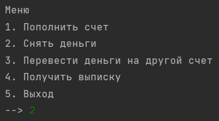
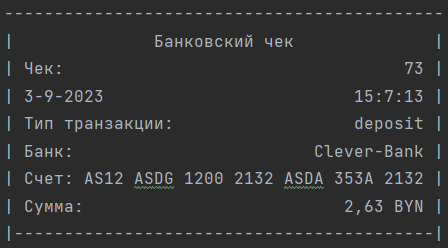
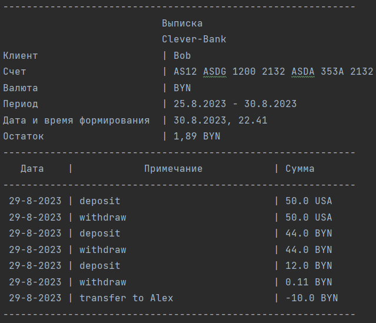

● Используемые технологии и библиотеки
● Список основных функций и возможностей проекта
● Информация о разработчиках
● Примеры использования проекта и скриншоты интерфейса

# Название проекта и краткое описание его назначения
Название проекта: BankApp

Краткое описание:
Проект является консольным приложением, разработанным на языке программирования Java с использованием базы данных MySql. Приложение предоставляет возможность управления банковским счетом, позволяя пользователям пополнять, переводить и снимать деньги со счета.

Одной из важных функциональностей приложения является фоновая проверка на начисление процентов на счет в конце каждого месяца. Это позволяет автоматически обновлять баланс счета, учитывая процентную ставку, указанную в системе.

Помимо этого, приложение также конвертирует валюты. Для этого используются исходные данные из файлов yml, которые содержат информацию о соотношении различных валют. Приложение позволяет пользователю выбрать валюту, в которой нужно перевести (снять/положить) деньги, и выполняет расчет на основе указанных в файле данных и в зависимости от валюты, в которой открыт счет.

В разработке проекта был применен паттерн стратегия, который позволяет гибко настраивать и изменять алгоритмы работы приложения в зависимости от требований. Этот паттерн обеспечивает высокую расширяемость и поддержку различных вариантов реализации функциональностей.

Основной целью проекта является обеспечение удобного и надежного управления банковским счетом, предоставляя пользователю широкий набор функций, а также автоматическое обновление баланса и возможность конвертации валют. Проект создан с соблюдением принципов официального стиля и написания кода, чтобы обеспечить чистоту, понятность и переиспользуемость.
# Инструкция по установке и запуску проекта
Для запуска приложения необходимо выполнить следующие шаги:

1. Установить Java Development Kit (JDK) версии 8 или выше.
2. Установить MySQL Server.
3. Создать базу данных (файл init.sql).
4. В файле "org/example/configs/Configs.java" указать параметры подключения к базе данных (название базы данных, имя пользователя и пароль).
5. Запустить приложение.

# Используемые технологии и библиотеки
- Java
- Gradle
- MySQL
- JUnit
- Lombok
- iTextPdf
- SnakeYAML

# Список основных функций и возможностей проекта
- Пополнение счета
- Снятие со счета
- Перевод между счетами
- Конвертация валют при переводах
- Автоматическое начисление процентов в конце месяца
- Получение чека в формате .txt
- Получение выписки в форматах .pdf и .txt

# Пример использования приложения:

- Авторизация в системе (ввод номера счета)
- Пополнение счета на 5000 рублей
- Перевод 1000 рублей на счет другого пользователя
- Просмотр выписки за месяц
- Выход из системы

# Информация о разработчиках и лицензии проекта
Разработчик: Колесинский Андрей

# Примеры использования проекта и скриншоты интерфейса

